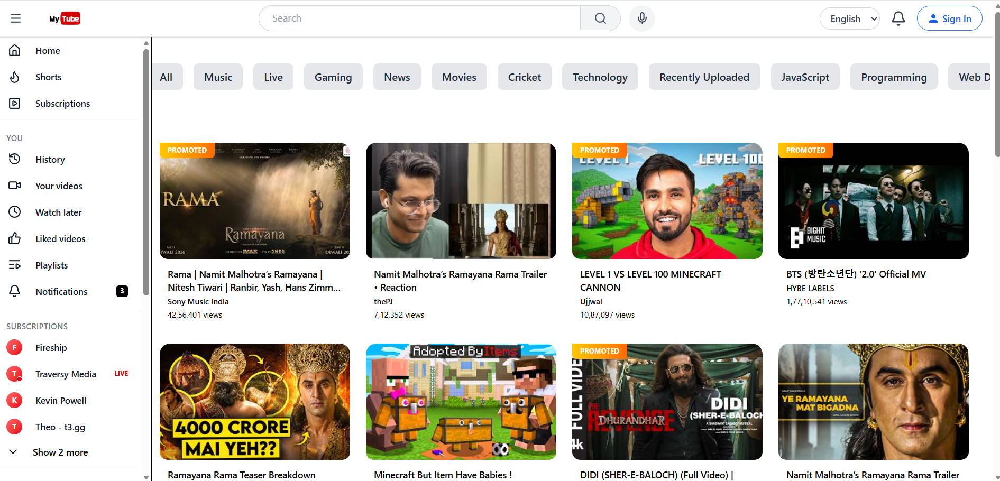
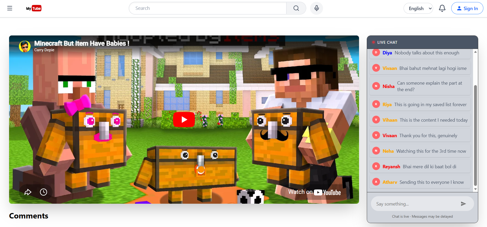
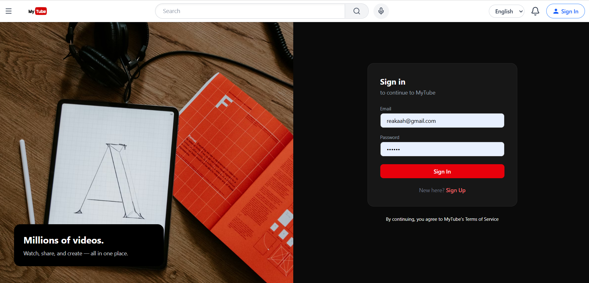
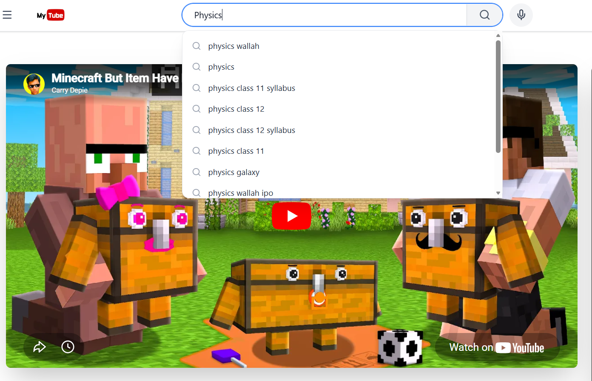
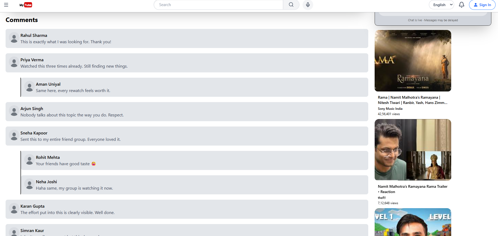

# 🎬 MyTube

A modern YouTube-inspired web application built using **React**, **Redux**, and **Tailwind CSS** — focused on performance, scalability, and clean UI/UX.

---

## 🚀 Features

### ⚡ Debounced Search

Implements **debouncing (200ms)** to reduce unnecessary API calls and improve performance during fast typing.

**How it works:**

- Keystroke gap **< 200ms** → API call is skipped
- Keystroke gap **≥ 200ms** → API call is triggered

**Performance comparison:**

| Scenario             | API Calls (per 1,000 users) |
| -------------------- | --------------------------- |
| Without Debouncing   | ~140,000 calls              |
| With Debouncing      | ~3,000 calls                |

> 98% reduction in API calls — significantly improves responsiveness across devices.

---

### 💬 Live Chat (Real-time Simulation)

Built using **API polling every 500ms** to mimic real-time chat similar to YouTube live streams.

- Users can send messages
- Messages are stored in a mock data store
- Each message shows the user's name, avatar (first letter), and content

---

### 🔐 Authentication (Firebase)

Secure login powered by **Firebase Authentication**.

- Login with validation — no invalid credentials allowed
- Logout functionality
- Persistent user session
- After login, user avatar (first letter in a styled circle) appears in the UI

---

### 📂 Sidebar Navigation

Persistent sidebar across all pages with sections like Home, History, Watch Later, Subscriptions, and more.

- Toggle (open/close) the sidebar
- Responsive behavior based on user interaction

---

## 🛠️ Tech Stack

| Technology            | Purpose                  |
| --------------------- | ------------------------ |
| React.js              | UI Library               |
| Redux Toolkit         | State Management         |
| Tailwind CSS          | Styling                  |
| Firebase              | Authentication           |
| Vite                  | Build Tool               |

---

## 📸 Screenshots

| Home | Live Chat |
|------|-----------|
|  |  |

| Login | Search Bar | Comments |
|-------|------------|----------|
|  |  |  |

---

---

## 📌 Note

This project is built for **learning and demonstration purposes**, inspired by YouTube's UI/UX and core features.

---

## 🧑‍💻 Author

**Aman Uniyal** — [LinkedIn](https://www.linkedin.com/in/aman-uniyal-1280b628b)
